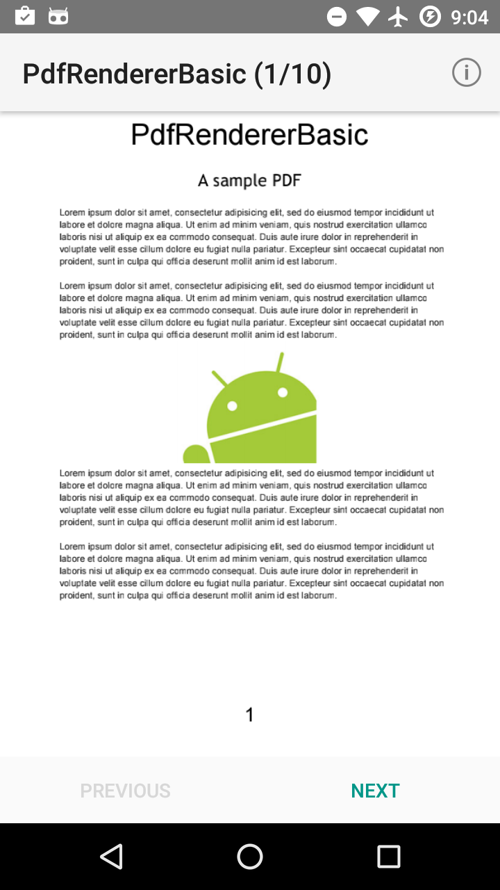
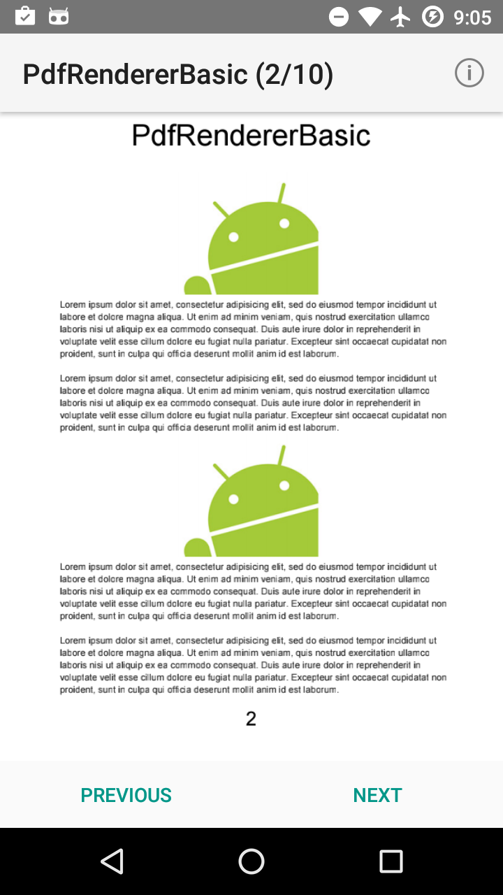

# What is it ? 

### Android Pdf Viewer (Lollipop) 
This demo shows how to render a pdf file in android and use this App as a pdf viewer. 

##### Pre-requisites
--------------

- Android SDK 24
- Android Build Tools v24.0.1
- Android Support Repository

##### Screenshots
-------------

  

##### Warning 
--------------

- Do not upgrade your gradle version to 2.2.0, keep it as 2.1.2 
- Do not use big file, cause native render can't handle big file.

##### Reference 
--------------

- In case someone might wanna edit pdf file, I will recommend MuPDF
http://mupdf.com/docs/how-to-build-mupdf-for-android

### Version
1.0 

