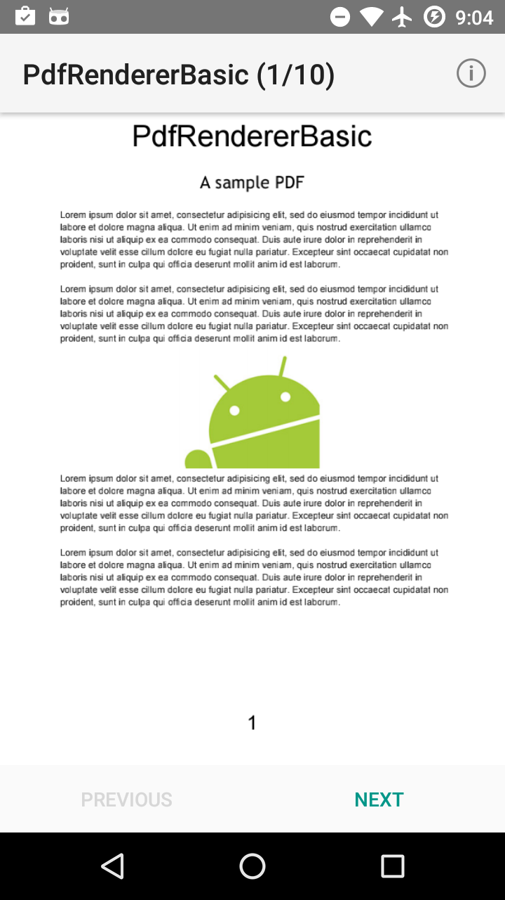

# What is it ? 
This repo is for Android samples, if I see or learn from somewhere, I will try to implement that as a reminder. 

### 1. Color Animation of TabLayout
You can see result/effect of this sample below. 

### 2. Jni Protection 
This demo shows how to use Jni check sign key signature, if we do this, that can prevent our apk from hacking. 

### 3. Blur Effect (StackBlur Algorithm)
This demo shows how to use "software-way" to create blur effect like iOS on Android platform 

Before Blur Effect. / After Blur Effect.

### 4. Android Pdf Viewer (Lollipop) 
This demo shows how to render a pdf file in android and use this App as a pdf viewer. 

##### Pre-requisites
--------------

- Android SDK 24
- Android Build Tools v24.0.1
- Android Support Repository

##### Screenshots
-------------

  

##### Warning 
--------------

- Do not upgrade your gradle version to 2.2.0, keep it as 2.1.2 
- Do not use big file, cause native render can't handle big file.

##### Reference 
--------------

- In case someone might wanna edit pdf file, I will recommend MuPDF
http://mupdf.com/docs/how-to-build-mupdf-for-android

### Version
1.0 

